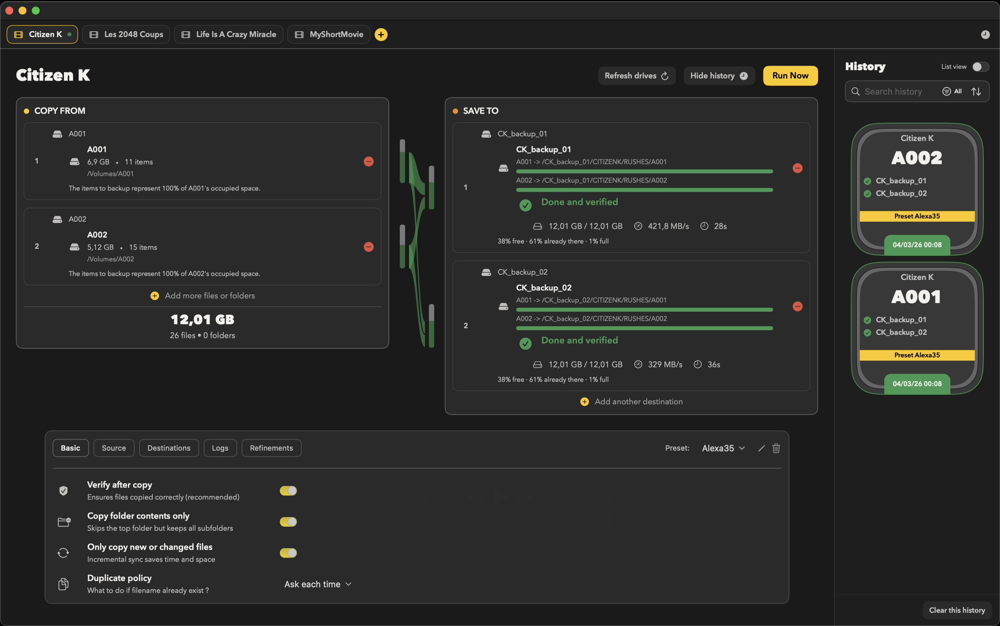

# FilmCan

<strong>Professional backup for camera cards.</strong>

Fast, verified, and free.

  <a href="docs/installation.md">Install</a> •
  <a href="docs/quickstart.md">Quick Start</a> •
  <a href="docs/index.md">Docs</a> •
  <a href="docs/faq.md">FAQ</a>

---

## What It Does

FilmCan backs up camera cards, rushes, folders, or files to multiple destinations with verification and organization presets—giving DITs, ACs, and cinematographers peace of mind through battle‑tested rsync.

- Copies multiple sources to multiples destinations
- Verifies every byte copied
- Auto-detect drives or folders
- Organizes files with custom folders presets
- Creates checksums for later verification

---

## Quick Start

1. Click **+ New Backup**
2. Drag your card into **Copy From**
3. Drag drives into **Save To**
4. Click **Run Now**

Done. FilmCan copies, verify and save checksums.

[More details →](docs/quickstart.md)

---

## Install

1. Download the **DMG** from [GitHub Releases](https://github.com/qtld88/FilmCan/releases) (recommended)
2. Open the DMG and drag `FilmCan.app` to **Applications**
3. Open FilmCan (macOS may block the first launch; go to **System Settings → Privacy & Security → Open Anyway**)
4. Grant permissions when prompted

[Full install guide →](docs/installation.md)

---

## Screenshot

---

## Support

- [Troubleshooting](docs/troubleshooting.md)
- [FAQ](docs/faq.md)
- [Documentation](docs/index.md)
- [Report a bug](docs/contributing.md)

---

## License

GNU GPL v3.0 — see [LICENSE](LICENSE)

---

<strong>Get it in the can.</strong>

